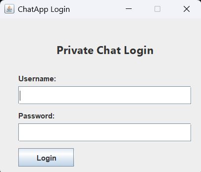
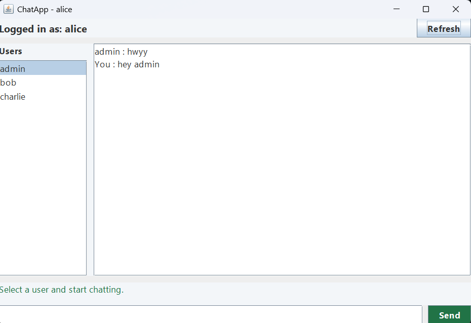
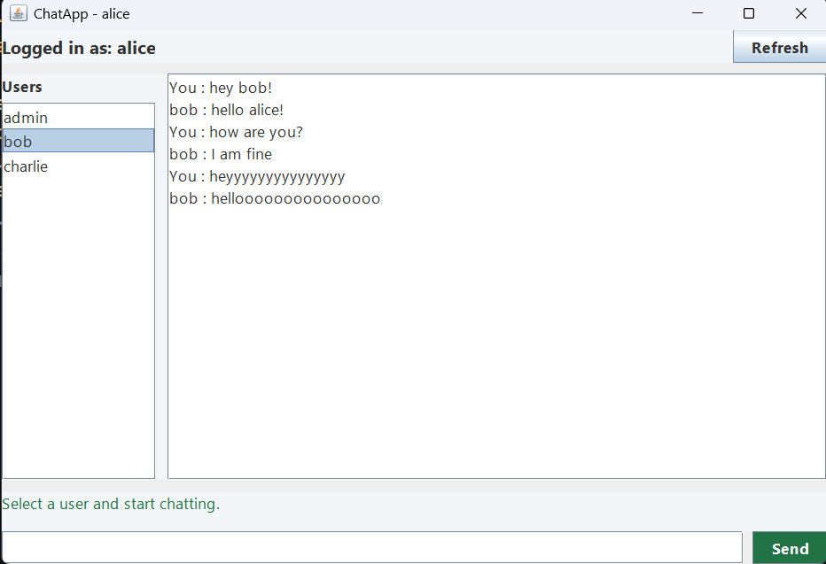

# ChatApp

A real-time desktop messaging application built using **Java, Swing, Socket Programming, Multithreading, JDBC, and MySQL**.

ChatApp enables multiple users to communicate instantly through a client-server architecture while maintaining persistent chat history in a MySQL database.

---

## Features

* Secure user authentication using MySQL
* Real-time one-to-one messaging
* Multi-client support using multithreading
* Persistent chat history storage
* Automatic chat history retrieval
* Dynamic user list loaded from database
* Client-server architecture using Java Sockets
* Modern Swing-based desktop interface
* Reconnect and refresh support

---

## Tech Stack

### Frontend

* Java Swing

### Backend

* Java
* Socket Programming
* Multithreading

### Database

* MySQL
* JDBC

---

## Project Architecture

```text
Client (Swing GUI)
        |
        | Socket Connection
        |
Chat Server (Multithreaded)
        |
        | JDBC
        |
      MySQL
```

---

## How It Works

1. User logs in using valid credentials.
2. Client connects to the Chat Server.
3. Server creates a dedicated thread for the client.
4. Messages are exchanged in real time.
5. Messages are stored in MySQL.
6. Previous conversations are loaded automatically when a chat is opened.

---

## Screenshots

### Login Screen

The login interface allows users to authenticate using credentials stored in the MySQL database.



---

### Chat Window

Real-time private messaging between connected users through a multithreaded socket server.



---

### Chat History

Previously exchanged messages are automatically loaded from the database when a conversation is opened.



----

## Installation

### Clone Repository

```bash
git clone https://github.com/azhann-01/ChatApp.git
cd ChatApp
```

### Configure Database

Create a MySQL database:

```sql
CREATE DATABASE chatapp;
```

Update database credentials inside:

```text
src/database/DBConnection.java
```

### Compile

```bash
javac -cp "lib/*" -d . src/**/*.java
```

### Start Server

```bash
java -cp ".;lib/*" server.ChatServer
```

### Start Client

```bash
java -cp ".;lib/*" gui.LoginFrame
```

---

## Demo Credentials

After importing the database, you can log in using:

| Username | Password |
|----------|----------|
| admin | admin123 |
| alice | alice123 |
| bob | bob123 |
| charlie | charlie123 |

----

## Concepts Demonstrated

* Object-Oriented Programming
* Socket Programming
* Client-Server Architecture
* Multithreading
* Database Connectivity
* GUI Development
* Concurrent User Handling

---

## Future Enhancements

* User Registration
* Password Hashing
* Online/Offline Status
* Message Timestamps
* File Sharing
* Group Chats
* Dark Mode
* End-to-End Encryption

---

## Author

**Md Azhan**

Computer Science Engineering Student

GitHub: https://github.com/azhann-01
